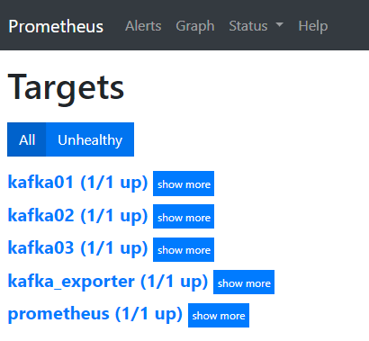

# Monitoring-Kafka
This project provides an easy to deploy kafka monitoring solution using docker and open source tools. Applying [Kafka Exporter](https://github.com/danielqsj/kafka_exporter) and *JMX Exporter* we extract some of the most important metrics needed to help you manage and monitor your running cluster. These metrics are then collected by *Prometheus* in order to be finally visualized in *Grafana* dashboards.

For some theory behind the tools we use, check this blog post [https://www.firasesbai.com/articles/2021/01/01/kafka-monitoring.html](https://www.firasesbai.com/articles/2021/01/01/kafka-monitoring.html) 
## Getting started 
These instructions will get you a copy of the project up and running on your local machine for development and testing purposes.
### Prerequisites
#### - docker
Get the Docker engine community edition following the steps in the official documentation [here](https://docs.docker.com/install/linux/docker-ce/ubuntu/).<br/>
This Setup was tested on Ubuntu 18.04. 
#### - docker-compose 
Install docker compose which relies on docker engine following the steps [here](https://docs.docker.com/compose/install/).
### Setup 
To deploy the different services, run the following command: 
```
docker-compose up -d 
```
This will start multiple containers on your host machine. For a distributed cluster deployment refer to this [repository](https://github.com/firasesbai/Kafka-Distributed-Cluster) baring in mind the necessary changes for the JMX configuration. 
<br><br>
The following URLs will be availabe:
* Prometheus -> http://localhost:9090/targets



* Grafana -> http://localhost:3000


## To Dos
The repository could be updated in the future with the following actions to extend and improve the solution:
- [x] Extend the monitoring to include Zookeeper
- [x] Extend the monitoring to include Kafka Connect
  - Using JMX
  - Using Rest API to restart connectors automatically in case of relatively long outages
- [ ] Extend the monitoring to include Kafka Producers and Consumers. 
- [ ] Enable alerting and email notifications for critical metrics in Grafana. This will require the update of some panels since currently only the graph panel visualization supports alerts.

## Contributing
Any feedback, bug reports, ideas or improvements are greatly appreciated.  

## Author
* **Firas Esbai** 
## Licence 
This project is licenced under the [Apache-2.0 Licence](https://www.apache.org/licenses/LICENSE-2.0)
